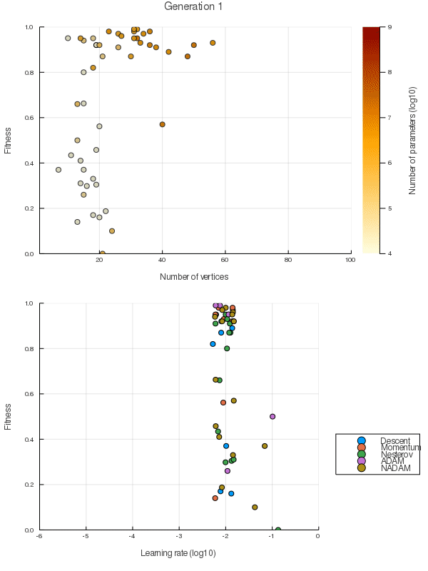

# NaiveGAflux

[](https://github.com/DrChainsaw/NaiveGAflux.jl/actions)
[](https://ci.appveyor.com/project/DrChainsaw/NaiveGAflux-jl)
[](https://codecov.io/gh/DrChainsaw/NaiveGAflux.jl)

Neural architecture search for [Flux](https://github.com/FluxML/Flux.jl) models using genetic algorithms.

A marketing person might describe it as "practical proxyless NAS using an unrestricted search space".

The more honest purpose is to serve as a pipe cleaner and example for [NaiveNASflux](https://github.com/DrChainsaw/NaiveNASflux.jl) which is doing most of the heavy lifting.

## Basic Usage

```julia
]add NaiveGAflux
```

The basic idea is to create not just one model, but a population of several candidate models with different hyperparameters. The whole population is then evolved while the models are being trained.

| MNIST                                 | CIFAR10                                |
|:-------------------------------------:|:--------------------------------------:|
|  |   |

More concretely, this means train each model for a number of iterations, evaluate the fitness of each model, select the ones with highest fitness, apply random mutations (e.g. add/remove neurons/layers) to some of them and repeat until a model with the desired fitness has been produced.

By controlling the number of training iterations before evolving the population, it is possible tune the compromise between fully training each model at the cost of longer time to evolve versus the risk of discarding a model just because it trains slower than the other members.

Like any self-respecting AutoML-type library, NaiveGAflux provides an application with a deceivingly simple API:

```julia
using NaiveGAflux.AutoFlux, MLDatasets

models = fit(CIFAR10.traindata())
```

It is possible (and strongly recommended) to supply a callback function which will receive the whole population of models as input after fitness for each generation has been calculated. A few useful functions are provided:

```julia
using NaiveGAflux, Plots
# Persist the whole population in directory models/CIFAR10 so that optimization can be resumed if aborted:
models = fit(CIFAR10.traindata(), cb=persist, mdir="models/CIFAR10")

# Plot best and average fitness for each generation
plotfitness = PlotFitness(plot, "models/CIFAR10");
# Plot data will be serialized in a subdir of "models/CIFAR10" for later postprocessing and for resuming optimization.
models = fit(CIFAR10.traindata(), cb=plotfitness, mdir="models/CIFAR10")


# Scatter plots from examples above:
scatterpop = ScatterPop(scatter, "models/CIFAR10");
scatteropt = ScatterOpt(scatter, "models/CIFAR10");

# Combine multiple plots in one figure:
multiplot = MultiPlot(display ∘ plot, plotfitness, scatterpop, scatteropt)

# Combine multiple callbacks in one function:
callbacks = CbAll(persist, multiplot)

models = fit(CIFAR10.traindata(), cb=callbacks, mdir="models/CIFAR10")
```  

However, most non-toy uses cases will probably require a dedicated application. NaiveGAflux provides the components to make building it easy and fun!

Tired of tuning hyperparameters? Once you've felt the rush from reasoning about hyper-hyperparameters there is no going back!

This package has the following main components:
1. [Search spaces](#search-spaces)
2. [Mutation operations](#mutation)
3. [Crossover operations](#crossover)
4. [Fitness functions](#fitness-functions)
5. [Candidate utilities](#candidate-utilities)
6. [Evolution strategies](#evolution-strategies)
7. [Iterators](#iterators)

Each component is described more in detail below.

Here is a very basic example just to get a feeling for the package:

```julia
using NaiveGAflux, Random
Random.seed!(NaiveGAflux.rng_default, 0)

nlabels = 3
ninputs = 5
inshape() = inputvertex("input", ninputs, FluxDense())

# Step 1: Create initial models
# Search space: 2-4 dense layers of width 3-10
layerspace = VertexSpace(DenseSpace(3:10, [identity, relu, elu, selu]))
initial_hidden = RepeatArchSpace(layerspace, 1:3)
# Output layer has fixed size and is shielded from mutation
outlayer = VertexSpace(Shielded(), DenseSpace(nlabels, identity))
initial_searchspace = ArchSpaceChain(initial_hidden, outlayer)

# Sample 5 models from the initial search space
model(invertex) = CompGraph(invertex, initial_searchspace(invertex))
models = [model(inshape()) for _ in 1:5]
@test nv.(models) == [4, 3, 4, 5, 3]

onehot(y) = Flux.onehotbatch(y, 1:nlabels)

# Some dummy data just to make stuff run
batchsize = 4
dataset = (randn(ninputs, batchsize), onehot(rand(1:nlabels, batchsize)))

# Fitness function for evolution, loss function and optimizer for models

# Not recommended to measure fitness on the training data for real usage.
fitfun = AccuracyFitness([dataset])
opt = Flux.Descent(0.01) # All models use the same optimizer here. Would be a bad idea with a stateful optimizer!
loss = Flux.Losses.logitcrossentropy
population = [CandidateModel(model, opt, loss, fitfun) for model in models]

# Step 2: Train the models
for candidate in population
    Flux.train!(candidate, dataset)
end

# Step 3: Evolve the population

# Mutations
mp(m, p) = VertexMutation(MutationProbability(m, p))
# Either add a layer (40% chance) or remove a layer (40% chance)
# You probably want to use lower probabilities than this
addlayer = mp(AddVertexMutation(layerspace), 0.4)
remlayer = mp(RemoveVertexMutation(), 0.4)

mutation = MutationChain(remlayer, addlayer)

# Selection
elites = EliteSelection(2)
mutate = SusSelection(3, EvolveCandidates(evolvemodel(mutation)))
selection = CombinedEvolution(elites, mutate)

# And evolve
newpopulation = evolve(selection, population)
@test newpopulation != population

# Repeat steps 2 and 3 until a model with the desired fitness is found.
```

### Search Spaces

The search space is a set of possible architectures which the search policy may use to create initial candidates or to extend existing candidates. Search spaces are constructed from simple components which can be combined in multiple ways, giving a lot of flexibility.

Lets start with the most simple search space, a `ParSpace`:

```julia
# Set seed of default random number generator for reproducible results
using NaiveGAflux, Random
Random.seed!(NaiveGAflux.rng_default, 1)

ps1d = ParSpace([2,4,6,10])

# Draw from the search space
@test ps1d() == 6
@test ps1d() == 10

# Possible to supply another rng than the default one
@test ps1d(MersenneTwister(0)) == 4

# Can be of any dimension and type
ps2d = ParSpace(["1","2","3"], ["4","5","6","7"])

@test typeof(ps1d) == ParSpace{1, Int}
@test typeof(ps2d) == ParSpace{2, String}

@test ps2d() == ("1", "4")
```

Lets have a look at an example of a search space for convolutional layers:

```julia
Random.seed!(NaiveGAflux.rng_default, 1)

cs = ConvSpace{2}(outsizes=4:32, activations=[relu, elu, selu], kernelsizes=3:9)

inputsize = 16
convlayer = cs(inputsize)

@test string(convlayer) == "Conv((8, 3), 16=>22, relu)"
```

Lastly, lets look at how to construct a complex search space:

```julia
Random.seed!(NaiveGAflux.rng_default, 0)

# VertexSpace creates a MutableVertex of layers generated by the wrapped search space
cs = VertexSpace(ConvSpace{2}(outsizes=8:256, activations=[identity, relu, elu], kernelsizes=3:5))
bs = VertexSpace(BatchNormSpace([identity, relu]))

# Block of conv->bn and bn->conv respectively.
# Need to make sure there is always at least one SizeAbsorb layer to make fork and res below play nice
csbs = ArchSpaceChain(cs ,bs)
bscs = ArchSpaceChain(bs, cs)

# Randomly generates either conv or conv->bn or bn->conv:
cblock = ArchSpace(ParSpace1D(cs, csbs, bscs))

# Generates between 1 and 5 layers from csbs
rep = RepeatArchSpace(cblock, 1:5)

# Generates between 2 and 4 parallel paths joined by concatenation (inception like-blocks) from rep
fork = ForkArchSpace(rep, 2:4)

# Generates a residual connection around what is generated by rep
res = ResidualArchSpace(rep)

# ... and a residual fork
resfork = ResidualArchSpace(fork)

# Pick one of the above randomly...
repforkres = ArchSpace(ParSpace1D(rep, fork, res, resfork))

# ...1 to 3 times
blocks = RepeatArchSpace(repforkres, 1:3)

# End each block with subsamping through maxpooling
ms = VertexSpace(PoolSpace{2}(windowsizes=2, strides=2, poolfuns=MaxPool))
reduction = ArchSpaceChain(blocks, ms)

# And lets do 2 to 4 reductions
featureextract = RepeatArchSpace(reduction, 2:4)

# Adds 1 to 3 dense layers as outputs
dense = VertexSpace(DenseSpace(16:512, [relu, selu]))
drep = RepeatArchSpace(dense, 0:2)
# Last layer has fixed output size (number of labels)
dout=VertexSpace(Shielded(), DenseSpace(10, identity))
output = ArchSpaceChain(drep, dout)

# Aaaand lets glue it together: Feature extracting conv+bn layers -> global pooling -> dense layers
archspace = ArchSpaceChain(featureextract, GlobalPoolSpace(), output)

# Input is 3 channel image
inputshape = inputvertex("input", 3, FluxConv{2}())

# Sample one architecture from the search space
graph1 = CompGraph(inputshape, archspace(inputshape))
@test nv(graph1) == 79

# And one more...
graph2 = CompGraph(inputshape, archspace(inputshape))
@test nv(graph2) == 128
```

### Mutation

Mutation is the way one candidate is transformed to a slightly different candidate. NaiveGAflux supports doing this while preserving parameters and alignment between layers, thus reducing the impact of mutating an already trained candidate.

The following basic mutation operations are currently supported:
1. Change the output size of vertices using `NoutMutation`.
2. Remove vertices using `RemoveVertexMutation`.
3. Add vertices using `AddVertexMutation`.
4. Remove edges between vertices using `RemoveEdgeMutation`.
5. Add edges between vertices using `AddEdgeMutation`.
6. Mutation of kernel size for conv layers using `KernelSizeMutation`.
7. Change of activation function using `ActivationFunctionMutation`.
8. Change the type of optimizer using `OptimizerMutation`.
9. Add an optimizer using `AddOptimizerMutation`.

In addition to the basic mutation operations, there are numerous utilities for adding behaviour and convenience. Here are a few examples:

```julia
using NaiveGAflux, Random
Random.seed!(NaiveGAflux.rng_default, 0)

invertex = inputvertex("in", 3, FluxDense())
layer1 = mutable(Dense(nout(invertex), 4), invertex)
layer2 = mutable(Dense(nout(layer1), 5), layer1)
graph = CompGraph(invertex, layer2)

mutation = NoutMutation(-0.5, 0.5)

@test nout(layer2) == 5

mutation(layer2)

@test nout(layer2) == 6

# VertexMutation applies the wrapped mutation to all vertices in a CompGraph
mutation = VertexMutation(mutation)

@test nout.(vertices(graph)) == [3,4,6]

mutation(graph)

# Input vertex is never mutated
@test nout.(vertices(graph)) == [3,5,8]

# Use the MutationShield trait to protect vertices from mutation
outlayer = mutable(Dense(nout(layer2), 10), layer2, traitfun = MutationShield)
graph = CompGraph(invertex, outlayer)

mutation(graph)

@test nout.(vertices(graph)) == [3,6,5,10]

# In most cases it makes sense to mutate with a certain probability
mutation = VertexMutation(MutationProbability(NoutMutation(-0.5, 0.5), 0.5))

mutation(graph)

@test nout.(vertices(graph)) == [3,7,5,10]

# Or just chose to either mutate the whole graph or don't do anything
mutation = MutationProbability(VertexMutation(NoutMutation(-0.5, 0.5)), 0.5)

mutation(graph)

@test nout.(vertices(graph)) == [3,10,6,10]

# Up until now, size changes have only been kept track of, but not actually applied
@test nout_org.(vertices(graph)) == [3,4,5,10]

Δoutputs(graph, v -> ones(nout_org(v)))
apply_mutation(graph)

@test nout.(vertices(graph)) == nout_org.(vertices(graph)) == [3,10,6,10]
@test size(graph(ones(3,1))) == (10, 1)

# NeuronSelectMutation keeps track of changed vertices and performs the above steps when invoked
mutation = VertexMutation(NeuronSelectMutation(NoutMutation(-0.5,0.5)))

mutation(graph)

@test nout.(vertices(graph)) == [3,11,7,10]
@test nout_org.(vertices(graph)) == [3,10,6,10]

select(mutation.m)

@test nout_org.(vertices(graph)) == [3,11,7,10]
@test size(graph(ones(3,1))) == (10, 1)

# Mutation can also be conditioned:
mutation = VertexMutation(MutationFilter(v -> nout(v) < 8, RemoveVertexMutation()))

mutation(graph)

@test nout.(vertices(graph)) == [3,11,10]

# When adding vertices it is probably a good idea to try to initialize them as identity mappings
addmut = AddVertexMutation(VertexSpace(DenseSpace(5, identity)), IdentityWeightInit())

# Chaining mutations is also useful:
noutmut = NeuronSelectMutation(NoutMutation(-0.8, 0.8))
mutation = VertexMutation(MutationChain(addmut, noutmut))
# For deeply composed blobs like this, it can be cumbersome to "dig up" the NeuronSelectMutation.
# neuronselect helps finding NeuronSelectMutations in the compositional hierarchy

# PostMutation lets us add actions to perform after a mutation is done (such as neuronselect)
logselect(m, g) = @info "Selecting parameters..."
mutation = PostMutation(mutation, logselect, neuronselect)

@test_logs (:info, "Selecting parameters...") mutation(graph)

@test nout.(vertices(graph)) == nout_org.(vertices(graph)) == [3,8,11,10]
```

### Crossover

Crossover is the way two candidates are combined to create new candidates. In NaiveGAflux crossover always maps two candidates into two new candidates. Just as for mutation, NaiveGAflux does this while preserving (to whatever extent possible) the parameters and alignment between layers of the combined models.

Crossover operations might not seem to make much sense when using parameter inheritance (i.e the concept that children retain the parameters of their parents). Randomly combining layers from two very different models will most likely not result in a well performing model. There are however a few potentially redeeming effects:

* Early in the evolution process parameters are not yet well fitted and inheriting parameters is not worse than random initialization
* A mature population on the other hand will consist mostly of models which are close relatives and therefore have somewhat similar weights.

Whether these effects actually make crossover a genuinely useful operation when evolving neural networks is not yet proven though. For now it is perhaps best to view the crossover operations as being provided mostly for the sake of completeness.

The following basic crossover operations are currently supported:
1. Swap segments between two models using `CrossoverSwap`.
2. Swap optimizers between two candidates using `OptimizerCrossover`.
3. Swap learning rate between two candidates using `LearningRateCrossover`.

Most of the mutation utilities also work with crossover operations. Here are a few examples:

```julia
using NaiveGAflux, Random
import NaiveGAflux: regraph
Random.seed!(NaiveGAflux.rng_default, 0)

invertex = inputvertex("A.in", 3, FluxDense())
layer1 = mutable("A.layer1", Dense(nout(invertex), 4), invertex; layerfun=ActivationContribution)
layer2 = mutable("A.layer2", Dense(nout(layer1), 5), layer1; layerfun=ActivationContribution)
layer3 = mutable("A.layer3", Dense(nout(layer2), 3), layer2; layerfun=ActivationContribution)
layer4 = mutable("A.layer4", Dense(nout(layer3), 2), layer3; layerfun=ActivationContribution)
modelA = CompGraph(invertex, layer4)

# Create an exact copy to show how parameter alignment is preserved
# Prefix names with B so we can show that something actually happened
changeprefix(str::String; cf) = replace(str, r"^A.\.*" => "B.")
changeprefix(x...;cf=clone) = clone(x...; cf=cf)
modelB = copy(modelA, changeprefix)

indata = reshape(collect(Float32, 1:3*2), 3,2)
@test modelA(indata) == modelB(indata)

@test name.(vertices(modelA)) == ["A.in", "A.layer1", "A.layer2", "A.layer3", "A.layer4"]
@test name.(vertices(modelB)) == ["B.in", "B.layer1", "B.layer2", "B.layer3", "B.layer4"]

# CrossoverSwap takes ones vertex from each graph as input and swaps a random segment from each graph
# By default it tries to make segments as similar as possible
swapsame = CrossoverSwap()

swapA = vertices(modelA)[4]
swapB = vertices(modelB)[4]
newA, newB = swapsame((swapA, swapB))

# It returns vertices of a new graph to be compatible with mutation utilities
# Parent models are not modified
@test newA ∉ vertices(modelA)
@test newB ∉ vertices(modelB)

# This is an internal utility which should not be needed in normal use cases.
modelAnew = regraph(newA)
modelBnew = regraph(newB)

@test name.(vertices(modelAnew)) == ["A.in", "A.layer1", "B.layer2", "B.layer3", "A.layer4"] 
@test name.(vertices(modelBnew)) == ["B.in", "B.layer1", "A.layer2", "A.layer3", "B.layer4"]

@test modelA(indata) == modelB(indata) == modelAnew(indata) == modelBnew(indata)

# Deviation parameter will randomly make segments unequal
swapdeviation = CrossoverSwap(0.5)
modelAnew2, modelBnew2 = regraph.(swapdeviation((swapA, swapB)))

@test name.(vertices(modelAnew2)) == ["A.in", "A.layer1", "A.layer2", "B.layer1", "B.layer2", "B.layer3", "A.layer4"] 
@test name.(vertices(modelBnew2)) == ["B.in", "A.layer3", "B.layer4"]

# VertexCrossover applies the wrapped crossover operation to all vertices in a CompGraph
# It in addtion, it selects compatible pairs for us (i.e swapA and swapB).
# It also takes an optional deviation parameter which is used when pairing
crossoverall = VertexCrossover(swapdeviation, 0.5)

modelAnew3, modelBnew3 = crossoverall((modelA, modelB))

# I guess things got swapped back and forth so many times not much changed in the end
@test name.(vertices(modelAnew3)) == ["A.in", "A.layer2", "A.layer4"]
@test name.(vertices(modelBnew3)) ==  ["B.in", "B.layer3", "B.layer1", "B.layer2", "A.layer1", "A.layer3", "B.layer4"] 

# As advertised above, crossovers interop with most mutation utilities, just remember that input is a tuple
# Perform the swapping operation with a 30% probability for each valid vertex pair.
crossoversome = VertexCrossover(MutationProbability(LogMutation(((v1,v2)::Tuple) -> "Swap $(name(v1)) and $(name(v2))", swapdeviation), 0.3))

@test_logs (:info, "Swap A.layer1 and B.layer1") (:info, "Swap A.layer2 and B.layer2") crossoversome((modelA, modelB))
```

### Fitness functions

A handful of ways to compute the fitness of a model are supplied. Apart from the obvious accuracy on some (typically held out) data set, it is also possible to measure fitness as how many (few) parameters a model has and how long it takes on average to perform a forward/backward pass. Fitness metrics can of course be combined to create objectives which balance several factors.

As seen below, some fitness functions are not trivial to use. [Candidate utilities](#candidate-utilities) helps managing this complexity behind a much simpler API.

Examples:

```julia
# Function to compute fitness for does not have to be a CompGraph, or even a neural network
candidate1 = x -> 3:-1:1
candidate2 = Dense(ones(Float32, 3,3), collect(Float32, 1:3))

# Fitness is accuracy on the provided data set
accfitness = AccuracyFitness([(ones(3, 1), 1:3)])

@test fitness(accfitness, candidate1) == 0
@test fitness(accfitness, candidate2) == 1

# Measure how long time it takes to train the function
import NaiveGAflux: Train, Validate
timetotrain = TimeFitness(Train())

# No training done yet...
@test fitness(timetotrain, candidate1) == 0
@test fitness(timetotrain, candidate2) == 0

# There is no magic involved here, we need to "instrument" the function to measure
candidate2_timed = instrument(Train(), timetotrain, candidate2)

# Instrumented function produces same result as the original function...
@test candidate2_timed(ones(3,1)) == candidate2((ones(3,1)))
# ... and TimeFitness measures time elapsed in the background
@test fitness(timetotrain, candidate2) > 0

# Just beware that it is not very clever, it just stores the time when a function it instrumented was run...
@test fitness(timetotrain, x -> sleep(0.2)) == fitness(timetotrain, x -> sleep(10))

# ... and it needs to be reset before being used for another candidate
# In practice you probably want to create one instance per candidate
reset!(timetotrain)
@test fitness(timetotrain, candidate1) == 0

# One typically wants to map short time to high fitness.
timefitness = MapFitness(x -> x == 0 ? 0 : 1/(x*1e6), timetotrain)

# Will see to it so that timetotrain gets to instrument the function
candidate2_timed = instrument(Train(), timefitness, candidate2)

@test candidate2_timed(ones(3,1)) == candidate2(ones(3,1))
@test fitness(timefitness, candidate2) > 0

# This also propagates ofc
reset!(timefitness)
@test fitness(timefitness, candidate2) == 0

# Use the number of parameters to compute fitness
nparams = SizeFitness()

@test fitness(nparams, candidate2) == 12

# This does not work unfortunately, and it tends to happen when combining fitness functions due to instrumentation
@test (@test_logs (:warn, "SizeFitness got zero parameters! Check your fitness function!") fitness(nparams, candidate2_timed)) == 0

# The mitigation for this is to "abuse" the instrumentation API
instrument(Validate(), nparams, candidate2)
@test fitness(nparams, candidate2_timed) == 12

# This however adds state which needs to be reset shall the function be used for something else
@test fitness(nparams, sum) == 12
reset!(nparams)
@test fitness(nparams, 1:3) == 3

# Combining fitness is straight forward
# Note that one typically wants to map low number of parameters to high fitness (omitted here for brevity)
combined = AggFitness(+, accfitness, nparams, timefitness)

@test fitness(combined, candidate2) == 13

# instrumentation will be aggregated as well
candidate2_timed = instrument(Train(), combined, candidate2)

@test candidate2_timed(ones(3,1)) == candidate2(ones(3,1))
@test fitness(combined, candidate2) > 13

# Special mention goes to NanGuard.
# It is hard to ensure that evolution does not produce a model which outputs NaN or Inf.
# However, Flux typically throws an exception if it sees NaN or Inf.
# NanGuard keeps the show going and assigns fitness 0 so that the model will not be selected.
nanguard = NanGuard(combined)

training_guarded = instrument(Train(), nanguard, candidate2)
validation_guarded = instrument(Validate(), nanguard, candidate2)

@test training_guarded(ones(3,1)) == validation_guarded(ones(3,1)) == candidate2(ones(3,1))

# Now the model gets corrupted somehow...
candidate2.weight[1,1] = NaN

@test any(isnan, candidate2(ones(3,1)))

@test (@test_logs (:warn, r"NaN detected for function with label Train()") training_guarded(ones(3,1))) == zeros(3,1)

@test (@test_logs (:warn, r"NaN detected for function with label Validate()") validation_guarded(ones(3,1))) == zeros(3,1)

@test fitness(nanguard, candidate2) == 0

# Now the model gets corrupted somehow...
candidate2.weight[1,1] = NaN

@test !any(isnan, candidate2(ones(3,1)))
@test training_guarded(ones(3,1)) == zeros(3,1)
@test validation_guarded(ones(3,1)) == zeros(3,1)
@test fitness(nanguard, candidate2) == 0

reset!(nanguard)
@test training_guarded(ones(3,1)) == validation_guarded(ones(3,1)) == candidate2(ones(3,1))
```

### Candidate utilities

The main component of a candidate is the model itself of course. There are however a few convenience utilities around candidate handling which may be useful.

As seen in the previous section, some fitness functions are not straight forward to use. By wrapping a model, a fitness function, a loss function and an optimizer in a `CandidateModel`, NaiveGAflux will hide much of the complexity and reduce the API to the following:

* `train!(candidate, data)`
* `fitness(candidate)`

Examples:

```julia
using Random
Random.seed!(NaiveGAflux.rng_default, 0)

archspace = RepeatArchSpace(VertexSpace(DenseSpace(3, elu)), 2)
inpt = inputvertex("in", 3)
dataset = (ones(Float32, 3, 1), Float32[0, 1, 0])

graph = CompGraph(inpt, archspace(inpt))
opt = Flux.ADAM(0.1)
loss = Flux.Losses.logitcrossentropy
fitfun = NanGuard(AccuracyFitness([dataset]))

# CandidateModel is the most basic candidate and handles things like fitness instrumentation
candmodel = CandidateModel(graph, opt, loss, fitfun)

Flux.train!(candmodel, Iterators.repeated(dataset, 20))
@test fitness(candmodel) > 0

# HostCandidate moves the model to the GPU when training or evaluating fitness and moves it back afterwards
# Useful for reducing GPU memory consumption (at the cost of longer time to train as cpu<->gpu move takes some time).
# Note, it does not move the data. GpuIterator can provide some assistance here...
dataset_gpu = GpuIterator([dataset])
fitfun_gpu = NanGuard(AccuracyFitness(dataset_gpu))
hostcand = HostCandidate(CandidateModel(graph, Flux.ADAM(0.1), loss, fitfun_gpu))

Flux.train!(hostcand, dataset_gpu)
@test fitness(hostcand) > 0

# CacheCandidate is a practical necessity if using AccuracyFitness.
# It caches the last computed fitness value so it is not recomputed every time fitness is called
cachinghostcand = CacheCandidate(hostcand)

Flux.train!(cachinghostcand, dataset_gpu)
@test fitness(cachinghostcand) > 0
```

Evolving a candidate is not limited to evolving the model. In general any aspect might be useful to search over and NaiveGAflux tries to not be opinionated here.

The function `evolvemodel` is a convenience method for creating functions which evolve `AbstractCandidate`s. Apart from handling mutation is also ensures that everything is copied so that an evolved candidate does not accidentally share any state with its parent.

```julia
graphmutation = VertexMutation(NeuronSelectMutation(NoutMutation(-0.5,0.5)))
optimizermutation = OptimizerMutation([Descent, Momentum, Nesterov])
evofun = evolvemodel(graphmutation, optimizermutation)

# This should perhaps be of type AbstractMutation{AbstractCandidate} for the sake of consistency.
# Until a usecase for it materializes it is just an anonymous function though.
@test evofun isa Function

evolvedcand = evofun(cachinghostcand)

@test typeof(evolvedcand) == typeof(cachinghostcand)

@test nout.(vertices(NaiveGAflux.graph(evolvedcand))) == [3, 4, 4]
@test nout.(vertices(graph)) == [3, 3, 3]

optimizer(c::AbstractCandidate) = optimizer(c.c)
optimizer(c::CandidateModel) = typeof(c.opt)

@test optimizer(cachinghostcand) == ADAM
@test optimizer(evolvedcand) == Nesterov
```

### Evolution Strategies

Evolution strategies are the functions used to evolve the population in the genetic algorithm from one generation to the next. The following is performed by evolution strategies:

* Select which candidates to use for the next generation
* Mutate the selected candidates
* Reset/clear state so that the population is prepared for the next generation

Examples:

```julia
# For controlled randomness in the examples
struct FakeRng end
Base.rand(::FakeRng) = 0.7

# Dummy candidate for brevity
struct Cand <: AbstractCandidate
    fitness
end
NaiveGAflux.fitness(d::Cand) = d.fitness

# EliteSelection selects the n best candidates
elitesel = EliteSelection(2)
@test evolve(elitesel, Cand.(1:10)) == Cand.([10, 9])

# EvolveCandidates maps candidates to new candidates (e.g. through mutation)
evocands = EvolveCandidates(c -> Cand(fitness(c) + 0.1))
@test evolve(evocands, Cand.(1:10)) == Cand.(1.1:10.1)

# SusSelection selects n random candidates using stochastic uniform sampling
# Selected candidates will be forwarded to the wrapped evolution strategy before returned
sussel = SusSelection(5, evocands, FakeRng())
@test evolve(sussel, Cand.(1:10)) == Cand.([4.1, 6.1, 8.1, 9.1, 10.1])

# CombinedEvolution combines the populations from several evolution strategies
comb = CombinedEvolution(elitesel, sussel)
@test evolve(comb, Cand.(1:10)) == Cand.(Any[10, 9, 4.1, 6.1, 8.1, 9.1, 10.1])

# AfterEvolution calls a function after evolution is completed
afterfun(pop) = map(c -> Cand(2fitness(c)), pop)
afterevo = AfterEvolution(comb, afterfun)
@test evolve(afterevo, Cand.(1:10)) == Cand.(Any[20, 18, 8.2, 12.2, 16.2, 18.2, 20.2])

# Its mainly intended for resetting
ntest = 0
NaiveGAflux.reset!(::Cand) = ntest += 1

resetafter = ResetAfterEvolution(comb)
@test evolve(resetafter, Cand.(1:10)) == Cand.(Any[10, 9, 4.1, 6.1, 8.1, 9.1, 10.1])
@test ntest == 7
```

### Iterators

While not part of the scope of this package, some simple utilities for iterating over data sets is provided.

The only iterator which is in some sense special for this package is `RepeatPartitionIterator` which produces iterators over a subset of its wrapped iterator. This is useful when there is a non-negligible cost of "switching" models, for example if `HostCandidate` is used as it allows training one model on the whole data subset before moving on to the next model.

Examples:

```julia
data = reshape(collect(1:4*5), 4,5)

# mini-batching
biter = BatchIterator(data, 2)
@test size(first(biter)) == (4, 2)

# shuffle data before mini-batching
# Warning: Must use different rng instances with the same seed for features and labels!
siter = ShuffleIterator(data, 2, MersenneTwister(123))
@test size(first(siter)) == size(first(biter))
@test first(siter) != first(biter)

# Apply a function to each batch
miter = MapIterator(x -> 2 .* x, biter)
@test first(miter) == 2 .* first(biter)

# Move data to gpu
giter = GpuIterator(miter)
@test first(giter) == first(miter) |> gpu

labels = collect(0:5)

# Possible to use Flux.onehotbatch for many iterators
biter_labels = Flux.onehotbatch(BatchIterator(labels, 2), 0:5)
@test first(biter_labels) == Flux.onehotbatch(0:1, 0:5)

# This is the only iterator which is "special" for this package:
rpiter = RepeatPartitionIterator(zip(biter, biter_labels), 2)
# It produces iterators over a subset of the wrapped iterator (2 batches in this case)
piter = first(rpiter)
@test length(piter) == 2
# This allows for easily training several models on the same subset of the data
expiter = zip(biter, biter_labels)
for modeli in 1:3
    for ((feature, label), (expf, expl)) in zip(piter, expiter)
        @test feature == expf
        @test label == expl
    end
end
```

## Contributing

All contributions are welcome. Please file an issue before creating a PR.
